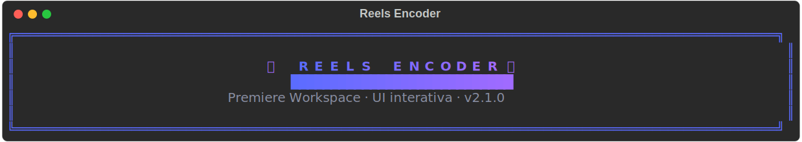
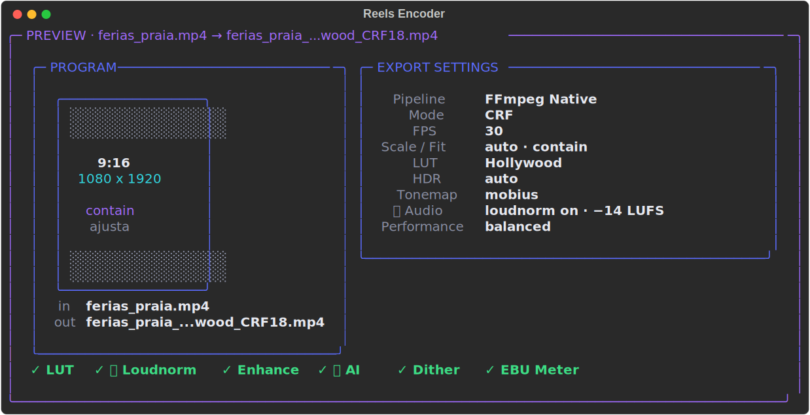
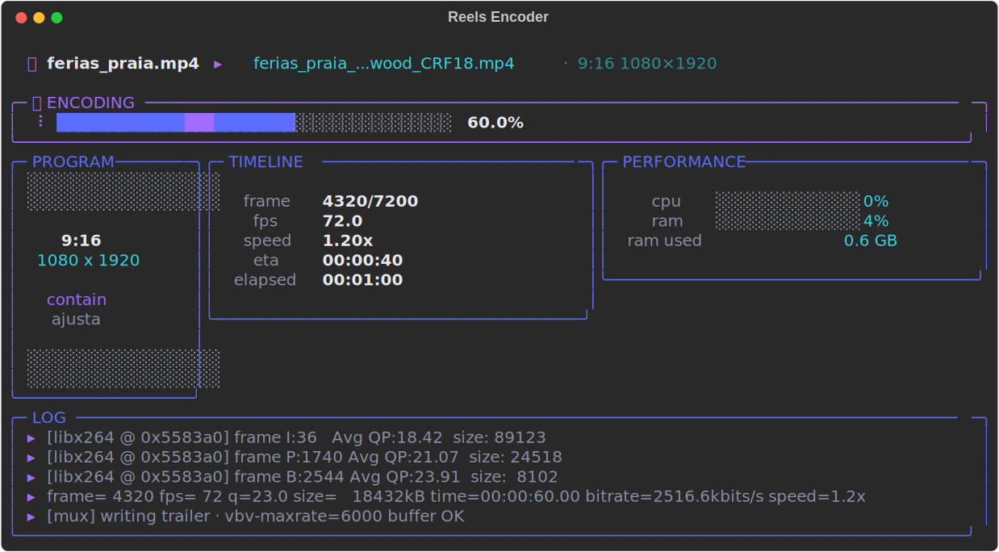
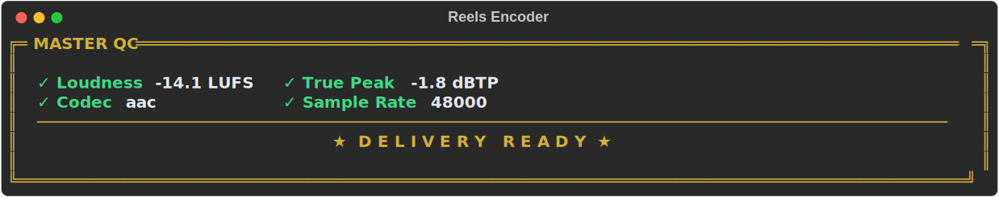

<div align="center">


[](https://www.python.org/)
[](https://ffmpeg.org/)
[](https://www.colour-science.org/)
[](https://github.com/gabrielschoenardie/encoder_ai_instagram)
[](https://github.com/gabrielschoenardie/encoder_ai_instagram/commits)
[](https://github.com/gabrielschoenardie/encoder_ai_instagram/stargazers)

**Sistema profissional de codificação de vídeo para Instagram Reels**  
*Qualidade cinematográfica com IA adaptativa — do seu arquivo ao Reels sem perda de qualidade*

</div>

---

## 📑 Tabela de Conteúdo

- [✨ O que é?](#-o-que-é)
- [🎬 Demonstração](#-demonstração)
- [⚡ Início Rápido](#-início-rápido)
- [📋 Requisitos](#-requisitos)
- [📦 Portabilidade — FFmpeg embarcado](#-portabilidade--ffmpeg-embarcado)
- [🚀 Instalação Completa](#-instalação-completa)
- [🎛️ Uso & Opções CLI](#️-uso--opções-cli)
- [🏗️ Arquitetura](#️-arquitetura)
- [🤖 Módulo de IA — FASE 27](#-módulo-de-ia--fase-27)
- [🎨 Color Science](#-color-science)
- [🔧 Ferramentas Auxiliares](#-ferramentas-auxiliares)
- [🧪 Testes](#-testes)
- [🗺️ Roadmap](#️-roadmap)
- [🤝 Contribuindo](#-contribuindo)
- [👤 Autor](#-autor)

---

## ✨ O que é?

**Reels Encoder AI** é um sistema de codificação de vídeo desenvolvido especificamente para **Instagram Reels**. Ele combina dois motores de encoding — um rápido baseado em FFmpeg e um cinematográfico com emulação de filme — com um módulo de IA que analisa cada vídeo e aplica automaticamente filtros de aprimoramento (denoise, deband, sharpen) apenas onde são necessários.

### Por que usar?

| Problema comum | Como este encoder resolve |
|---|---|
| Vídeo fica borrado no Instagram | VBV presets otimizados para cada duração |
| Cores lavadas após upload | LUT HollywoodCinema v6.7B + pipeline Cineon |
| Banding visível em gradientes | AI detecta e aplica deband adaptativo |
| Áudio muito alto/baixo | Normalização automática EBU R128 (2-pass) |
| 4K fica pesado demais | Downscale automático para 1080p |
| Grãos e ruído no resultado | NLMeans/bilateral denoise inteligente |

---

## 🎬 Demonstração

> 📸 **Capturas reais da UI** (renderizadas headless via `tools/gen_readme_assets.py` — Rich `save_svg`):

<p align="center"></p>

**Launcher — card de PREVIEW (program 9:16 + quality chips):**
<p align="center"></p>

**Dashboard ao vivo (Program · Timeline · Performance · Log):**
<p align="center"></p>

**Selo de entrega — MASTER QC (auditoria EBU R128 pós-encode):**
<p align="center"></p>

---

## ⚡ Início Rápido

### 3 passos para o primeiro encode

```bash
# 1. Clone e instale
git clone https://github.com/gabrielschoenardie/encoder_ai_instagram.git
cd encoder_ai_instagram
pip install -r requirements.txt

# 2. Encode básico (pipeline rápido)
python Reels_Encoder_v2_FINAL.py meu_video.mp4

# 3. Encode cinematográfico (film emulation)
python Reels_Encoder_v2_FINAL.py meu_video.mp4 --cineon-pipeline on
```

### 🎛️ UI interativa (estilo Premiere Pro)

Rode **sem argumentos** (ou com `--ui`) para abrir o launcher interativo: menu de
presets, configuração por abas (Source · Color/LUT · Audio · Enhance · Export),
**preview das configurações** antes do encode e um dashboard ao vivo com progresso,
fps/speed/ETA, monitor de performance (CPU/RAM) e log. A CLI tradicional continua
100% idêntica — a UI é uma camada aditiva.

```bash
python Reels_Encoder_v2_FINAL.py            # abre o launcher
python Reels_Encoder_v2_FINAL.py --ui       # força o launcher
```

> Conceito visual e plano completo: [`docs/terminal-ui-masterplan.md`](docs/terminal-ui-masterplan.md).
> Para a melhor renderização (cores truecolor + glyphs), use o **Windows Terminal**.

### Exemplos mais usados

```bash
# Máxima qualidade com IA + film look
python Reels_Encoder_v2_FINAL.py video.mp4 \
  --cineon-pipeline on \
  --enhance on \
  --enhance-ai on \
  --exposure-offset +0.3 \
  --saturation 1.1

# Batch: processar uma pasta inteira
python Reels_Encoder_v2_FINAL.py --batch ./clips/ --output-dir ./reels/

# Ver info de hardware (sem fazer encode)
python Reels_Encoder_v2_FINAL.py --hardware-info

# Pipeline rápido com IA ativada
python Reels_Encoder_v2_FINAL.py video.mp4 --enhance on --enhance-ai on
```

---

## 📋 Requisitos

| Dependência | Versão mínima | Obrigatório |
|---|---|---|
| Python | 3.9+ | ✅ |
| FFmpeg | 4.4+ | ✅ |
| pymediainfo | 1.0.0+ | ✅ |
| av (PyAV) | 11.0.0+ | ✅ (modo Cineon) |
| numpy | 1.24.0+ | ✅ |
| scipy | 1.10+ | ✅ |
| Pillow | 10.0.0+ | ✅ |
| rich | 13.0.0+ | ✅ |
| pydantic | 2+, <3 | ✅ |
| psutil | 5.9.0+ | ✅ |
| colour-science | 0.4.7+ | ✅ (modo Cineon) |
| opencv-python | 4.8.0+ | ⚪ opcional (banding detection) |
| CuPy | qualquer | ⚪ opcional (GPU acceleration) |

> ⚪ Dependências opcionais ativam funcionalidades extras mas não são obrigatórias para o funcionamento básico.

### FFmpeg — duas rotas

O encoder aceita o FFmpeg de **duas** formas (veja a seção de Portabilidade abaixo):

```bash
# Rota A — FFmpeg no sistema (PATH)
sudo apt install ffmpeg        # Ubuntu/Debian
brew install ffmpeg            # macOS (Homebrew)
# Windows: winget install -e --id BtbN.FFmpeg.GPL.6.1  (ou baixe em https://ffmpeg.org/download.html)

# Rota B — FFmpeg embarcado em ./bin (portátil, sem instalar no sistema)
./tools/fetch_ffmpeg.ps1       # Windows: baixa/copia o FFmpeg 6.1 para ./bin
# macOS/Linux: copie ffmpeg/ffprobe (build estático) para ./bin
```

---

## 📦 Portabilidade — FFmpeg embarcado

O encoder localiza cada binário do FFmpeg por um **resolvedor de 3 níveis** (`ui/binaries.py`):

1. **`./bin`** — binários embarcados na raiz do projeto (prioridade máxima).
2. **`PATH`** — instalação do sistema.
3. **Nome nu** — como fallback final (deixa o SO resolver).

- **`ffmpeg` + `ffprobe`** são **obrigatórios**; **`ffplay`** é **opcional** (usado só pelo monitor EBU visual — sem ele, a auditoria de loudness continua rodando).
- Os binários em `./bin` são **git-ignored** — cada máquina traz os seus. Veja [`bin/README.md`](bin/README.md).

### Por plataforma

| Plataforma | Automático | Manual |
|---|---|---|
| **Windows** | `./tools/fetch_ffmpeg.ps1` (winget `BtbN.FFmpeg.GPL.6.1`, FFmpeg 6.1) | copie `ffmpeg.exe`/`ffprobe.exe`/`ffplay.exe` para `bin/` |
| **macOS** | `brew install ffmpeg` | copie os binários (build estático) para `bin/` |
| **Linux** | `sudo apt install ffmpeg` | copie um build estático para `bin/` |

> Se faltar `ffmpeg`/`ffprobe`, a UI mostra um card de dependência ausente com as duas rotas de correção.

---

## 🚀 Instalação Completa

```bash
# 1. Clone o repositório
git clone https://github.com/gabrielschoenardie/encoder_ai_instagram.git
cd encoder_ai_instagram

# 2. (Recomendado) Crie um ambiente virtual
python -m venv venv
source venv/bin/activate       # Linux/macOS
venv\Scripts\activate          # Windows

# 3. Instale as dependências
pip install -r requirements.txt

# 4. Valide a instalação
python tools/verificador_instalacao.py
```

A saída do verificador indicará quais dependências estão OK e quais estão faltando.

### Instalação via pip

Também é possível instalar como pacote e obter o comando `reels-encoder`:

```bash
# Instalação padrão
pip install .

# Modo desenvolvimento (editável)
pip install -e .

# Depois, use o comando de console:
reels-encoder input.mp4
reels-encoder --version

# Recurso opcional com aceleração OpenCV (há fallback para PIL):
pip install ".[opencv]"
```

> Nota: a instalação via pip usa o FFmpeg do sistema (PATH). Para embarcar o FFmpeg em `./bin`, rode a partir do código-fonte (veja `bin/README.md`).

---

## 🎛️ Uso & Opções CLI

```
python Reels_Encoder_v2_FINAL.py [input] [opções]
```

### Opções por categoria

#### 🎬 Pipeline

| Argumento | Valores | Padrão | Descrição |
|---|---|---|---|
| `--cineon-pipeline` | `on/off` | `off` | Ativa pipeline DWG/Cineon film emulation |
| `--cineon-lut` | caminho | `FilmLook_Portra400...cube` | LUT .cube para o modo Cineon |
| `--mode` | `crf/2pass` | `crf` | Modo de encoding |

#### 🎨 Grading & Cor

| Argumento | Valores | Padrão | Descrição |
|---|---|---|---|
| `--lut` | `on/off` | `on` | Aplica HollywoodCinema LUT v6.7B |
| `--exposure-offset` | `-2.0` a `+2.0` | `0.0` | Ajuste de exposição em stops (EV) |
| `--saturation` | `0.0` a `2.0` | `1.0` | Ajuste de saturação |
| `--hdr` | `auto/off` | `auto` | Conversão HDR→SDR automática |
| `--tonemap` | `mobius/reinhard/hable/bt2390` | `mobius` | Algoritmo tone mapping HDR |

#### 🤖 IA & Enhancement

| Argumento | Valores | Padrão | Descrição |
|---|---|---|---|
| `--enhance` | `on/off` | `on` | Ativa Enhancement Engine (FASE 27) |
| `--enhance-ai` | `on/off` | `on` | Usa MockCNN para decisões de filtro (requer `--enhance on`) |
| `--dither` | `on/off/auto` | `auto` | Blue-noise dithering anti-banding |
| `--mctf` | `on/off` | `on` | Máscara MCTF com optical flow anti-flicker |

#### ⚙️ Qualidade & Vídeo

| Argumento | Valores | Padrão | Descrição |
|---|---|---|---|
| `--fps` | `auto/24/25/30/60` | `30` | Frame rate do output |
| `--scale` | `auto/off` | `auto` | Downscale automático 4K→1080p |
| `--fit` | `contain/cover` | `contain` | Enquadramento 9:16: `contain` preserva tudo (letterbox); `cover` preenche e corta as bordas |
| `--performance` | `quality/balanced/speed` | `balanced` | Perfil de performance |
| `--threads` | inteiro | `0` (auto) | Override manual de threads |

#### 🔊 Áudio

| Argumento | Valores | Padrão | Descrição |
|---|---|---|---|
| `--loudnorm` | `on/off` | `on` | Normalização EBU R128 2-pass (-14 LUFS, -1.5 dBTP) |
| `--ebu-meter` | `on/off` | `on` | QC pós-encode: monitor EBU R128 (FFplay) ANTES/DEPOIS. A auditoria de loudness roda sempre |

**Pipeline de loudness (EBU R128, 2-pass verdadeiro):**

- **Pass 1 — medição:** analisa o áudio com `loudnorm:print_format=json` e extrai `input_i/tp/lra/thresh` + `target_offset`.
- **Pass 2 — normalização linear:** reaplica os valores medidos com `linear=true` e o `offset` do Pass 1 (máxima precisão, sem compressão dinâmica).
- **Alvos Instagram/Reels:** **-14 LUFS** integrado (evita que o Instagram re-normalize o loudness) e **-1.5 dBTP** de true peak (margem contra clipping no transcode AAC do Instagram).
- **Canais:** saída **sempre estéreo** (o Instagram aceita mono/estéreo, mas rejeita 5.1). Fontes **mono** recebem correção `dual_mono` (-3 LU); fontes **multicanal (5.1)** são downmixadas para estéreo *dentro* da cadeia de filtros — nos dois passes — para que medição e entrega usem o mesmo layout.
- **Codec de saída:** AAC-LC, 48 kHz, estéreo, 192 kbps.
- **Segurança:** áudio silencioso/inválido ou que exija ganho > 25 dB desativa o loudnorm automaticamente (evita amplificar ruído).

**Auditoria EBU R128 pós-encode (`--ebu-meter`):**

Inspirado no projeto [`ebu-meter.rs`](https://github.com/NapoleonWils0n/ffmpeg-rust-scripts). Após cada encode:

- **Auditoria automática (sempre, inclusive em batch):** mede o arquivo final com o filtro canônico `ebur128` e exibe uma tabela comparativa **ANTES (original) × DEPOIS (final)** — Integrated (LUFS-I), True Peak (dBTP), Loudness Range (LU), Codec e Sample Rate — com selos `✓`/`⚠` contra o alvo Instagram (-14 LUFS, ≤ -1.5 dBTP). É só medição/auditoria: o loudnorm 2-pass continua sendo o único método de normalização.
- **Monitor visual FFplay (opcional, padrão ATIVADO):** abre duas janelas de medidor EBU R128 broadcast (`ebur128=video=1`) — uma do original, uma do final — para QC visual lado a lado. Não-bloqueante; feche quando terminar. Use `--ebu-meter off` para desativar. **Desativado automaticamente no modo `--batch`** (a auditoria continua rodando por arquivo).
- **Robusto:** sem áudio / silêncio (`-inf`) → coluna `—`; `ffplay` ausente → aviso e tabela mesmo assim; qualquer falha de QC nunca interrompe o encode.

```bash
python Reels_Encoder_v2_FINAL.py input.mp4                 # auditoria + monitor EBU (padrão)
python Reels_Encoder_v2_FINAL.py input.mp4 --ebu-meter off # só auditoria, sem janelas FFplay
```

#### 📁 Batch & Output

| Argumento | Valores | Padrão | Descrição |
|---|---|---|---|
| `--batch` | caminho da pasta | — | Processa todos os vídeos de uma pasta |
| `--output-dir` | caminho | mesma do input | Pasta de destino para os arquivos |

#### 🖥️ Sistema

| Argumento | Valores | Padrão | Descrição |
|---|---|---|---|
| `--show-hardware` | `on/off` | `on` | Exibe perfil de hardware antes do encode |
| `--hardware-info` | flag | — | Exibe hardware e sai (sem fazer encode) |
| `--ui` | flag | — | Abre o launcher interativo (estilo Premiere) |
| `--debug` | flag | — | Mostra o traceback técnico completo em erros |
| `--version` | flag | — | Mostra a versão e sai |

---

## 🏗️ Arquitetura

### Dois pipelines disponíveis

```
┌─────────────────────────────────────────────────────────────────────┐
│  PIPELINE 1 — FFmpeg Nativo (padrão)                                │
│                                                                      │
│  Input ──► Análise AI ──► Filtros FFmpeg ──► libx264 ──► Output     │
│             (5 frames)     deband → denoise → sharpen → LUT v6.7B   │
│                                                                      │
│  Performance: ~30-60 fps (GPU)  |  Bitrate: 6.5–12 Mbps             │
└─────────────────────────────────────────────────────────────────────┘

┌─────────────────────────────────────────────────────────────────────┐
│  PIPELINE 2 — Cineon Film Emulation (novo, v2.0)                    │
│                                                                      │
│  Input ──► PyAV decode ──► Enhancement NumPy ──► 5 Nodes Cineon ──► │
│                              (por frame)                             │
│                                                                      │
│  Node 1: Rec.709 → DaVinci Wide Gamut                               │
│  Node 2: Primary Grading (exposure + saturation)                    │
│  Node 3: Tone/Gamut Mapping (100 nits, ACES-derived)                │
│  Node 4: Cineon Film Log (Colour-Science certified)                 │
│  Node 5: Portra 400 LUT (trilinear 3D)                              │
│                              │                                       │
│                              ▼                                       │
│                     FFmpeg pipe → libx264 → Output                  │
│                                                                      │
│  Performance: ~5-15 fps (CPU) | ~30-60 fps (GPU com CuPy)           │
└─────────────────────────────────────────────────────────────────────┘
```

### Fluxo de decisão da IA

```
5 frames amostrais (10%, 25%, 50%, 75%, 90%)
          │
          ▼
  ┌───────────────────┐
  │   3 Analyzers     │
  │  ┌─────────────┐  │
  │  │ noise.py    │  │──► σ, low_freq_ratio, uniformity
  │  │ banding.py  │  │──► severity, gradient_score, flat_region_pct
  │  │ detail.py   │  │──► sharpness, texture, edges, freq_low/mid/high
  │  └─────────────┘  │
  └─────────┬─────────┘
            │  13 features
            ▼
  ┌─────────────────────────────┐
  │  MockCNN (13 → 8 → 3)      │
  │  Layer 1: sigmoid [8 nós]   │
  │  Layer 2: sigmoid [3 nós]   │
  └─────────┬───────────────────┘
            │  [denoise_w, sharpen_w, deband_w]
            ▼
  ┌──────────────────────────────────────────┐
  │  Filtros Adaptativos                     │
  │  denoise  ──► nlmeans / bilateral / gauss │
  │  deband   ──► gradient reconstruct       │
  │  sharpen  ──► unsharp / CAS              │
  └──────────────────────────────────────────┘
```

### Estrutura de arquivos

```
encoder_ai_instagram/
├── Reels_Encoder_v2_FINAL.py     # Entry point — parsing CLI, hardware, dispatch
├── cineon_pipeline.py             # Pipeline Cineon 5 nodes
├── ebu_meter.py                   # Auditoria/monitor EBU R128 pós-encode
├── enhance_visualizer.py          # Heatmaps diagnósticos por frame
├── version.py                     # Versão única (__version__)
├── enhance_ai_log.json            # Log das execuções de IA (gerado em runtime)
├── pyproject.toml                 # Empacotamento pip (comando reels-encoder)
├── MANIFEST.in                    # Inclusão de LUTs/dados no pacote
├── requirements.txt
├── MANUAL_INSTALACAO.txt          # Guia completo em português
├── *.cube                         # LUTs de cor:
│   ├── FilmLook_Portra400_SkinPriority_D65.cube
│   └── HollywoodCinema_Ultimate_v6.7B_1.5IRE_Instagram8bit_NeutralShadows.cube
│
├── enhance/                       # Módulo de IA (FASE 27)
│   ├── analyzers/
│   │   ├── banding.py             # Análise de banding (histograma, gradientes)
│   │   ├── noise.py               # Estimativa de ruído (Gaussian σ, FFT)
│   │   └── detail.py              # Sharpness, textura, bordas, frequências
│   ├── ai/
│   │   ├── mock_cnn.py            # Rede neural 13→8→3 (sigmoid)
│   │   └── interface.py           # Interface abstrata EnhanceModel
│   ├── profile.py                 # EnhanceProfile e matriz de decisão
│   ├── processor.py               # Chain de filtros por frame
│   ├── ffmpeg_filters.py          # Gerador de filter graph FFmpeg
│   ├── sampler.py                 # Amostragem de 5 frames representativos
│   ├── test_mock_cnn.py           # Testes unitários MockCNN
│   └── test_processors.py         # Testes de integração filtros
│
├── ui/                            # UI interativa estilo Premiere (aditiva)
│   ├── theme.py                   # Paleta, estilos Rich, glyphs (get_console)
│   ├── config.py                  # EncodeConfig (Pydantic) ↔ argparse.Namespace
│   ├── components.py              # Renderáveis: banner, preview, selo, log…
│   ├── prompts.py                 # Inputs interativos validados
│   ├── launcher.py                # run_launcher() (wizard de presets/abas)
│   ├── dashboard.py               # EncodeDashboard ao vivo (make_dashboard)
│   ├── aspect.py                  # Classificação de aspecto/orientação
│   ├── probe.py                   # Dimensões efetivas da fonte (ffprobe)
│   ├── binaries.py                # Resolvedor ./bin → PATH → nome nu
│   ├── preflight.py               # Checagem de dependências FFmpeg
│   └── test_*.py                  # Suíte de testes da UI (105 testes)
│
├── bin/                           # FFmpeg embarcado (git-ignored)
│   ├── README.md                  # Como preencher ./bin
│   └── .gitignore                 # Ignora os binários
│
├── docs/
│   ├── assets/*.svg               # Capturas reais da UI (geradas)
│   └── terminal-ui-masterplan.md  # Plano/rationale da UI
│
└── tools/
    ├── verificador_instalacao.py  # Valida todas as dependências
    ├── gen_readme_assets.py       # Gera as capturas SVG da UI (headless)
    ├── fetch_ffmpeg.ps1           # Baixa/copia o FFmpeg 6.1 para ./bin (Windows)
    ├── compare_frames.py          # Comparação antes/depois
    ├── time_to_frame.py           # Navegação por frame
    └── clean_cache.py             # Limpeza de temporários
```

---

## 🤖 Módulo de IA — FASE 27

O módulo `enhance/` implementa uma **engine de aprimoramento adaptativa** que analisa cada vídeo individualmente antes de aplicar qualquer filtro.

### Como funciona

**1. Amostragem** — 5 frames são extraídos em posições estratégicas (10%, 25%, 50%, 75%, 90% da duração), garantindo representatividade de cenas diferentes.

**2. Análise — vetor de 13 features:**

| Feature | Origem | O que mede |
|---|---|---|
| `sigma` | noise.py | Desvio padrão do ruído Gaussiano |
| `low_freq_ratio` | noise.py | Energia de baixa frequência (FFT) |
| `uniformity` | noise.py | Consistência do ruído em grade 8×8 |
| `banding_severity` | banding.py | Gaps no histograma + gradientes quantizados |
| `gradient_score` | banding.py | Suavidade dos gradientes |
| `flat_region_pct` | banding.py | % de regiões planas (risco de banding) |
| `sharpness` | detail.py | Variância do Laplaciano (nitidez) |
| `texture_complexity` | detail.py | Complexidade de textura |
| `edge_density` | detail.py | Densidade de bordas (Sobel) |
| `freq_low/mid/high` | detail.py | Decomposição em bandas de frequência |

**3. MockCNN** — Rede neural 2 camadas (sigmoid):
- Arquitetura: `13 → 8 → 3`
- Saída: `[denoise_weight, sharpen_weight, deband_weight]` ∈ [0.0, 1.0]
- Latência: ~0.01ms por inferência
- Projetado para substituição futura por modelo ONNX/PyTorch

**4. Filtros adaptativos aplicados:**

| Filtro | Métodos disponíveis |
|---|---|
| Denoise | NLMeans (OpenCV), Bilateral, Gaussiano |
| Deband | Reconstrução de gradiente (edge-protected) |
| Sharpen | Unsharp mask, CAS (Contrast Adaptive Sharpening) |

### Log de decisões

Cada execução com `--enhance on --enhance-ai on` gera entrada em `enhance_ai_log.json`:

```json
{
  "timestamp": "2026-06-03T20:21:20",
  "model": "MockCNN_v1_sigmoid_2layer",
  "input_file": "video.mp4",
  "ai_weights": {
    "denoise": 0.121,
    "sharpen": 0.528,
    "deband": 0.243
  },
  "decisions": {
    "denoise_method": "gaussian",
    "sharpen_enabled": true,
    "deband_strength": 0.243
  }
}
```

### Visualização de heatmaps

```bash
python enhance_visualizer.py meu_video.mp4
```

Gera imagens diagnósticas mostrando onde cada filtro atua:
- `deband_map` — Risco de banding por região (azul=baixo, vermelho=alto)
- `noise_map` — Energia de ruído por região
- `sharpen_map` — Regiões de detalhe/bordas

---

## 🎨 Color Science

### LUTs incluídas

| Arquivo | Estilo | Uso recomendado |
|---|---|---|
| `FilmLook_Portra400_SkinPriority_D65.cube` | Kodak Portra 400 (film) | Retratos, pele, cotidiano |
| `HollywoodCinema_Ultimate_v6.7B_1.5IRE_Instagram8bit_NeutralShadows.cube` | Cinema Hollywood | Conteúdo dramático, cinematic |

### Pipeline Cineon — color science certificada

```
Rec.709 (camera)
    │
    ▼  Node 1
DaVinci Wide Gamut (DWG)    ← ACES-derived, D65 whitepoint
    │
    ▼  Node 2
Primary Grading             ← exposure + saturation adjustments
    │
    ▼  Node 3
Tone/Gamut Mapping          ← 100 nits, adaptation 9.0, saturation compression
    │
    ▼  Node 4
Cineon Film Log             ← Colour-Science certified transformation
    │
    ▼  Node 5
Portra 400 LUT              ← Interpolação trilinear 3D
    │
    ▼
Output Rec.709 8-bit        ← Pronto para Instagram
```

Processamento em **float32** em todos os nodes → zero banding mesmo em gradientes extremos.

---

## 🔧 Ferramentas Auxiliares

### Verificador de instalação

```bash
python tools/verificador_instalacao.py
```

Verifica Python, FFmpeg, todas as dependências Python e exibe status de cada componente.

### Comparação de frames

```bash
# Comparação lado a lado: original vs. encodado
python tools/compare_frames.py original.mp4 encodado.mp4

# Modo interativo
python tools/compare_frames_interactive.py original.mp4 encodado.mp4
```

### Navegação por frame

```bash
# Extrair frame em um timestamp específico
python tools/time_to_frame.py video.mp4 00:01:23

# Modo interativo
python tools/time_to_frame_interactive.py video.mp4
```

### Limpeza de cache

```bash
python tools/clean_cache.py
```

### FFmpeg embarcado (Windows)

```powershell
# Baixa/copia o FFmpeg 6.1 (ffmpeg + ffprobe + ffplay) para ./bin
./tools/fetch_ffmpeg.ps1
```

### Capturas da UI para o README

```bash
# Renderiza banner, preview, dashboard e selo MASTER QC em docs/assets/*.svg
python tools/gen_readme_assets.py
```

---

## 🧪 Testes

```bash
# Todos os testes (IA + UI interativa) — comando canônico
python -m pytest enhance/ ui/ -v

# Só o módulo de IA
python -m pytest enhance/ -v

# Só a UI interativa (105 testes)
python -m pytest ui/ -v

# Um arquivo específico
python -m pytest enhance/test_mock_cnn.py -v
python -m pytest ui/test_config.py -v
```

A suíte cobre:
- Predições do MockCNN para casos extremos (vídeo limpo, vídeo ruidoso, banding severo)
- Chain denoise → deband → sharpen (ordem e força dos filtros)
- Integridade do vetor de features (normalização, limites)
- UI (`ui/`, 105 testes): round-trip do `EncodeConfig`, tokens do tema, render dos
  componentes, wiring do launcher e matemática/render do dashboard

---

## 🗺️ Roadmap

- [x] **UI interativa estilo Premiere** — launcher com presets, abas e dashboard ao vivo ✓
- [x] **Perfis de preset** — presets no launcher (menu de configuração rápida) ✓
- [x] **Portabilidade / FFmpeg embarcado** — resolvedor `./bin` + `fetch_ffmpeg.ps1` ✓
- [x] **Empacotamento pip** — instalável como pacote com o comando `reels-encoder` ✓
- [ ] **Modelo ONNX real** — substituir MockCNN por modelo treinado em dataset de vídeos reais
- [ ] **Suporte a GPU CuPy** — aceleração completa do pipeline Cineon em NVIDIA
- [ ] **Interface web** — dashboard para configurar e monitorar encodes em lote
- [ ] **Suporte a outros formatos** — TikTok, YouTube Shorts (ajuste de VBV/bitrate)
- [ ] **Treinamento do CNN** — pipeline de data labeling para substituir heurísticas
- [ ] **Plugin DaVinci Resolve** — integração como plugin de exportação

---

## 🤝 Contribuindo

Contribuições são bem-vindas! Para contribuir:

1. Faça um fork do repositório
2. Crie uma branch para sua feature: `git checkout -b feature/minha-feature`
3. Commit suas mudanças: `git commit -m 'Add: descrição da feature'`
4. Push para a branch: `git push origin feature/minha-feature`
5. Abra um Pull Request

### Áreas que precisam de contribuição

- 🧠 Treinamento de modelo real para substituir MockCNN
- 🖥️ Suporte a encoders de hardware (NVENC, VideoToolbox, QSV)
- 🌐 Internacionalização (inglês, espanhol)
- 📊 Métricas de qualidade (VMAF, SSIM, PSNR)
- 📝 Testes adicionais e cobertura

---

## 👤 Autor

**Gabriel Schoenardie**

- GitHub: [@gabrielschoenardie](https://github.com/gabrielschoenardie)
- Email: gschoenardie@gmail.com

---

<div align="center">

*Feito com ❤️ para criadores de conteúdo que não abrem mão de qualidade*

</div>
